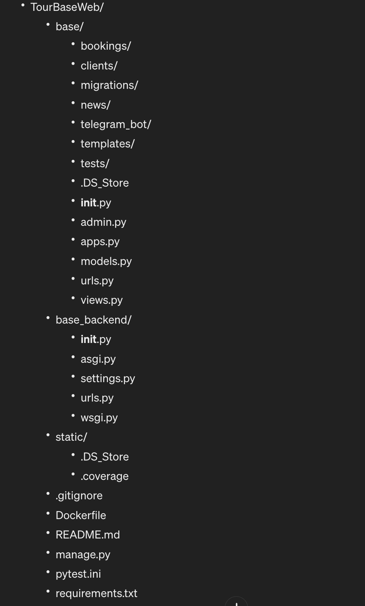

# TourBaseWeb

TourBaseWeb — это веб-приложение туристической базы, предназначенное для управления и организации туристических услуг. 
Проект включает в себя функционал для бронирования, управления клиентской информацией и интеграции с Telegram для уведомлений о заявки на бронирование.


## Структура проекта 




### Установка и запуск

Для установки и локального запуска проекта выполните следующие шаги:

*Клонирование репозитория:*

```sh
git clone <URL репозитория>
cd TourBaseWeb
```

*Создание виртуального окружения и установка зависимостей:*


```sh
python -m venv venv
source venv/bin/activate  # Используйте venv\Scripts\activate на Windows
pip install -r requirements.txt

```

*Настройка переменных окружения:*

Создайте файл .env на основе предоставленного шаблона и заполните его соответствующими значениями.

*Выполнение миграций:*

```sh
python manage.py migrate

```


*Запуск сервера разработки:*

```sh
python manage.py runserver

```

*Открытие веб-приложения в браузере:*

Перейдите по адресу http://127.0.0.1:8000 в вашем браузере.


### Тестирование

Выполните тесты, используя команду:


```sh
pytest

```


## Запуск приложения в Docker


1. Убедитесь, что Docker установлен. Если нет, загрузите и установите его с официального сайта Docker.


2. Клонируйте репозиторий и перейдите в папку проекта:

```sh
git clone <URL репозитория>
cd TourBaseWeb

```


3. Создайте файл *.env* на основе шаблона *.env.example*, который вы найдете в репозитории. Откройте .env.example, скопируйте его содержимое в новый файл .env и заполните необходимые переменные окружения.


4. Соберите Docker образ:

```sh
docker build -t tourbaseweb .

```


5. Запустите контейнер Docker, передав переменные окружения из файла .env:

```sh
docker run -d -p 8000:8000 --env-file .env tourbaseweb

```
Приложение будет доступно на http://localhost:8000 после запуска контейнера. 


### Тестирование в Docker

```sh

docker exec myapp_test_container pytest

```


